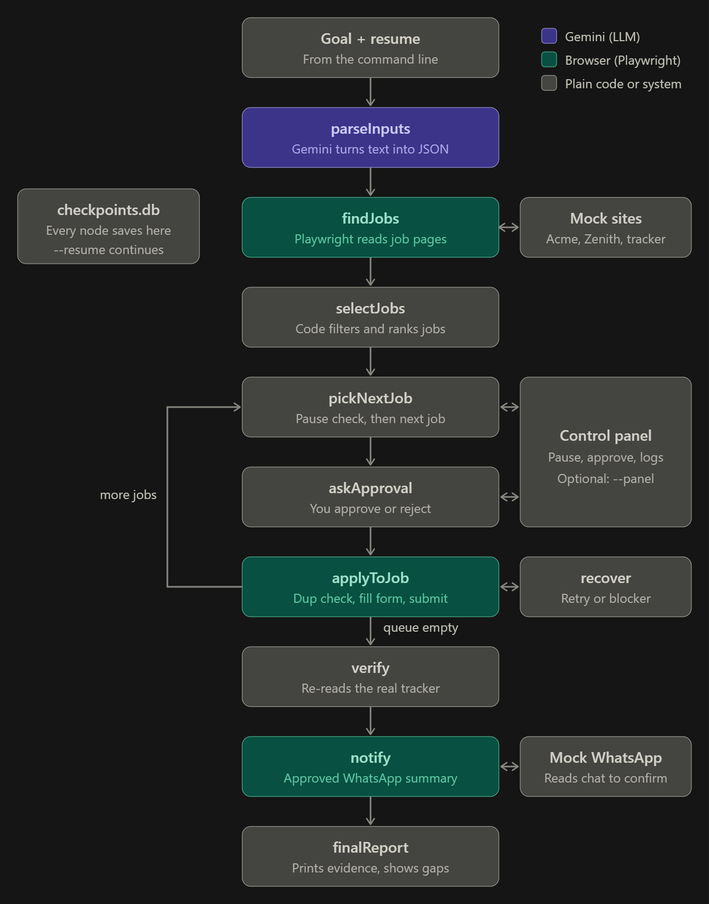

# HireHand — AI Job Application Operator

HireHand is a small autonomous operator that accepts a plain-English goal,
finds matching jobs on a mock career site, applies to them using a real
browser, and produces a verified report. It features human-in-the-loop
approval, crash recovery, and duplicate protection.

---

## What it does

Given a goal like *"Find 3 backend roles for this candidate and apply"*
and a resume file (text or PDF), the operator:

1. Parses the goal into structured filters (max applications, remote-only,
   keywords, companies, whether to notify via WhatsApp).
2. Parses the resume into a structured candidate profile (name, email,
   skills, experience, target roles).
3. Scrapes job listings from two mock companies (Acme and Zenith).
4. Ranks jobs by skill match and picks the top N.
5. Pauses for human approval before each application.
6. Fills and submits the application form using Playwright.
7. Recovers from failures by checking the tracker before retrying.
8. Sends a verified WhatsApp summary (if the goal asked for it).
9. Produces a final report showing what succeeded, what failed, and why.

---

## Features

- **Working execution** — real browser automation with Playwright.
- **Adaptability** — new goals and resumes work without code changes.
- **Recovery** — a dedicated `recover` node checks the tracker before
  retrying, avoiding duplicate submissions (including the "ghost save"
  case where the server saves but returns 500).
- **Verified completion** — every result is checked against the mock
  server's tracker before being marked as done.
- **Human control** — a terminal prompt and a web control panel for
  pause, resume, approve, and reject.
- **Crash recovery** — LangGraph checkpoints are persisted to SQLite,
  so a crashed run can resume with `--resume`.
- **Duplicate protection** — `alreadyApplied` checks the tracker before
  every submission, and `verify` catches duplicates after the fact.

---

## Architecture

The operator is a LangGraph state machine:



- **`parseInputs`** — runs `parseGoal` and `parseResume` in parallel.
- **`findJobs`** — scrapes job cards from `/acme/jobs` and `/zenith/jobs`,
  reading the actual Apply link from each card.
- **`selectJobs`** — plain code, no LLM: filters by remote, keywords,
  and experience, scores by skill overlap, sorts, and slices.
- **`pickNextJob`** — pops the next job and resets the attempt counter.
- **`askApproval`** — pauses for human approval (skipped with `--yes`).
- **`applyToJob`** — checks the tracker, then fills and submits the form.
- **`recover`** — decides whether to retry, mark as ghost-saved, or block.
- **`verify`** — compares the bot's beliefs against the tracker.
- **`notify`** — builds a WhatsApp summary, asks for approval, sends it,
  and verifies it arrived.
- **`finalReport`** — prints the summary and closes the browser.

---

## Prerequisites

- **Node.js 20+** (for modern ESM features)
- **Google Gemini API key** — get one from Google AI Studio
- **Playwright** — installed via `npm run setup`
- The mock server included in this repo

---

## Setup

1. **Clone the repository:**

   ```bash
   git clone https://github.com/Vaibhav-Pandey7/hirehand.git
   cd HireHand
   ```

2. **Install dependencies:**

   ```bash
   npm install
   ```

3. **Install Playwright's Chromium:**

   ```bash
   npm run setup
   ```

4. **Configure environment variables:**

   ```bash
   cp .env.example .env
   ```

   Then edit `.env` and paste your Gemini API key.

5. **Start the mock server** (in a separate terminal):

   ```bash
   npm run mock
   ```

   The mock server runs on `http://localhost:4000`.

---

## Usage

### Basic run

```bash
npm run operator -- "Find 3 backend roles for this candidate and apply" samples/resume-aarav.txt
```

The operator will:

- Parse the goal and resume.
- Find matching jobs.
- Pause and ask for approval before each job.
- Apply, verify, and print a final report.

### Flags

| Flag | Effect |
|------|--------|
| `--yes` | Auto-approve all jobs and messages (for testing) |
| `--panel` | Start the web control panel at `http://localhost:4100` |
| `--resume [thread_id]` | Resume a crashed run (uses `.last-run` if no ID is given) |

### Examples

**With the control panel:**

```bash
npm run operator -- "Find 2 backend roles, apply, and send me a WhatsApp update" samples/resume-aarav.txt --panel
```

**Resume after a crash:**

```bash
npm run operator -- --resume
```

**Automated test run:**

```bash
npm run operator -- "Find 3 backend roles and apply" samples/resume-aarav.txt --yes
```

---

## The Control Panel

When you pass `--panel`, a web dashboard opens at `http://localhost:4100`. It shows:

- **Live logs** — every `console.log` from the operator, streamed via Server-Sent Events.
- **Status bar** — Running, Paused, or Pause Requested.
- **Pause / Resume buttons** — control the operator from the browser.
- **Approval card** — appears when the operator asks a question; you can click Approve or Reject instead of typing in the terminal.

The panel competes with the terminal prompt. Whichever you answer first wins.

---

## Pause and Resume

The operator can be paused between jobs using a sentinel file. From a second terminal:

```bash
npm run pause     # requests a pause
npm run unpause   # resumes
```

Or use the Pause / Resume buttons in the control panel. The pause takes effect **between jobs**, not mid-form. The current job finishes first.

---

## Recovery Strategy

The operator distinguishes between two kinds of failures:

**1. Pre-submit failures** (no click happened)

- Missing required field, no form found, Gemini error before submission.
- `maybeSaved: false`, `retryable: true`.
- Safe to retry immediately, because no request was sent to the server.

**2. Post-submit failures** (a click happened)

- Server 500, timeout, or crash after clicking submit.
- `maybeSaved: true`, `retryable: false`.
- The `recover` node checks the tracker:
  - If a row exists → mark as `submitted` (ghost save). No retry.
  - If no row → retry once.
  - If the tracker is unreachable → block to avoid duplicates.

Retries are capped at 2 attempts per job.

---

## Testing Recovery

The mock server exposes three failure modes, each fires once then resets:

| Mode | Behavior |
|------|----------|
| `/admin/fail/500` | Saves nothing, returns 500 |
| `/admin/fail/ghost` | Saves the application, then returns 500 |
| `/admin/fail/timeout` | Never responds, never saves |

Reset the tracker with `/admin/reset`.

**Test the ghost case** (the most important one):

```bash
# Open http://localhost:4000/admin/reset
# Open http://localhost:4000/admin/fail/ghost
npm run operator -- "Find 3 backend roles and apply" samples/resume-aarav.txt --yes
```

Expected: `[recover] ... saved despite error, no retry needed`. The final report shows `rows in tracker: 1` (never 2).

---

## Limitations

- **Pause is between jobs, not mid-form.** If you pause while a form is being filled, the current job finishes first.
- **Log history is in-memory.** It survives the browser session but not a process restart.
- **No CAPTCHA or anti-bot handling.** The mock server has none by design.
- **Server-side deduplication is absent.** The mock server allows duplicates; the client is responsible.
- **The control panel binds to 127.0.0.1 only.** It has no login, so it must not be exposed to a network.

---

## AI Assistance

Gemini is used for:

- Parsing the goal into structured filters.
- Parsing the resume into a structured profile.
- Mapping candidate data to form fields.

The following are **plain code**:

- Job selection and scoring.
- The LangGraph state machine.
- The recovery logic and tracker checks.
- The verification step.
- Human control (approval, pause, resume).

---

## Project Layout

```text
.
├── control-panel/            # Control panel frontend
│   └── index.html            # Dashboard UI (port 4100)
├── docs/                     # Documentation assets
│   └── image.png             # Architecture diagram
├── mock-world/               # Mock career site and tracker
│   ├── data/                 # JSON files (jobs, applications, messages)
│   └── server.js             # Mock server (port 4000)
├── operator/                 # The operator core
│   ├── browser/              # Playwright helpers
│   ├── nodes/                # LangGraph nodes
│   ├── tests/                # Test scripts for parsers and recovery
│   ├── agent.js              # Gemini API wrapper
│   ├── control.js            # Pause + approval hub
│   ├── graph.js              # The LangGraph state machine
│   ├── index.js              # CLI entry point
│   ├── pause.js              # Pause CLI script
│   ├── runtime.js            # Browser singleton manager
│   ├── server.js             # Control panel backend (SSE + API)
│   └── state.js              # LangGraph state schema
├── samples/                  # Sample resumes for testing
│   ├── resume-aarav.txt
│   └── resume-meera.txt
├── .env.example              # Environment variable template
├── .gitignore                # Git ignore rules
├── package-lock.json         # Dependency lockfile
├── package.json              # Project metadata and scripts
└── README.md                 # This file
```

*Note: The following files are generated at runtime and are not committed to the repository: `.env`, `.last-run`, `.pause`, `checkpoints.db`, `checkpoints.db-shm`, `checkpoints.db-wal`.*